# OS Midterm report

## A: OpenMP

#### Requirement
    - เขียนโปรแกรมภาษา C เพื่อรับค่า N และตัวเลข N จำนวนจากนั้นหาค่าเฉลี่ยของตัวเลขที่รับเข้ามา
    - ใช้ได้แค่ #pragma omp parallel


#### Report
    หลังจากที่ผ่านวิชา Discrete Math 
    ผมก็ได้รู้จักกับ Modular Arithmetic ทำให้มีความเข้าใจ Modulo มากขึ้น 
    จึงได้ตัดสินใจนำมันมาใช้ในการแบ่งเธรดหาผลรวมเลข
    จากสมบัติที่ว่า a mod X จะได้ค่าที่อยู่ในช่วง 0 ถึง X-1 สำหรับจำนวนเต็ม a ใดๆ
    และ a + nX mod X = a Mod X สำหรับจำนวนเต็ม a และ n ใดๆ
    จากสองข้อนี้สามารถนำมาใช้แบ่งงานให้เธรดได้
    โดยนำจำนวนของเธรดมาใช้เป็น Modulus value
    จากนั้นสร้างอาร์เรย์ local_sums[num_threads] ขึ้นมาเก็บผลรวมของแต่ละเธรดโดยใช้ไอดีของเธรดเป็นอินเด็กซ์ในอาร์เรย์
    ทำการวนลูปเพื่อหาผลรวมของแต่ละเธรดโดยใช้ไอดีของเธรดเป็นอินเด็กซ์เริ่มต้นและจะเพิ่มค่าขึ้นตามจำนวนเธรด
    เมื่อสิ้นสุดการวนลูปก็จะหาผลรวมจากค่าที่ได้ของแต่ละเธรดที่อยู่ในอาร์เรย์ 
    แล้วค่อยนำมาหารด้วย N เพื่อหาค่าเฉลี่ย

#### Diagram
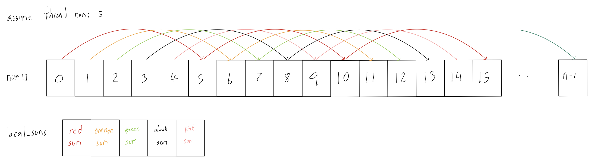


#### Code
```c
#include <stdio.h>
#include <omp.h>

int main() {
    int N;
    scanf("%d", &N);

    int num[N];

    for (int i = 0; i < N; i++) {
        scanf("%d", &num[i]);
    }

    int sum = 0;
    int num_threads = omp_get_max_threads();
    int local_sums[num_threads];

    #pragma omp parallel
    {
        int thread_id = omp_get_thread_num();
        local_sums[thread_id] = 0;

        for (int i = thread_id; i < N; i += num_threads) {
            local_sums[thread_id] += num[i];
        }
    }

    for (int i = 0; i < num_threads; i++) {
        sum += local_sums[i];
    }

    int average = sum / N;
    printf("%d\n", average);

    return 0;
}
```

## B: Memory Management

#### Requirement
    - ให้แสดงว่า Stack โตลงและ Heap โตขึ้น
    - ให้แสดงว่าในแต่ละครั้งที่มีการเรียกใช้ฟังก์ชัน กำหนดตัวแปร หรือจองหน่วยความจำ 
    แอดเดรสที่เกี่ยวข้องมีการเปลี่ยนแปลงอย่างไร
    - Function call stack ที่ซ้อนกันอย่างงน้อย 3 ครั้ง
    - malloc อย่างน้อย 3 ครั้ง
    - Global variable อย่างน้อย 3 ตัว
    - ทำให้เกิด Stackoverflow

#### Output
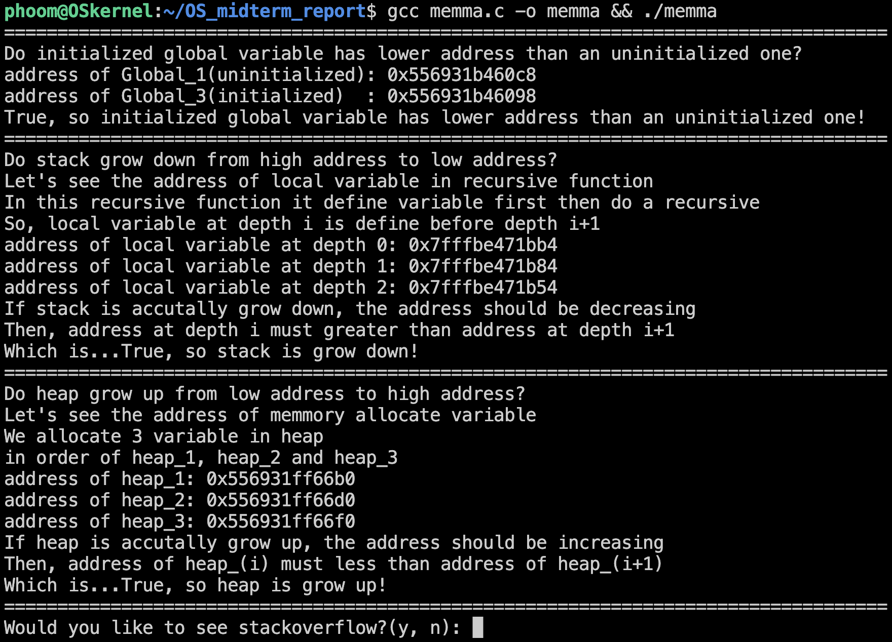
#### Stackoverflow
    

#### Report
    โดยโปรแกรมจะทำการสร้าง 
    - recursive function ขึ้นมาชื่อว่า summation ที่จะบวกเลขตั้งแต่ n ถึง 1 โดยสามารถกำหนดขั้นที่จะลดลงได้ (ปกติควรจะเป็น 1) และจะเก็บแอดเดรสของตัวแปรไว้ในอารเรย์
    - Global Variable ทั้งแบบ initialized และ uninitialized
    - pointer ที่ชี้ไปยังพื้นที่ที่ถูกจองด้วย malloc ที่สามารถเก็บตัวเลขได้ 5 ตัว
    จากนั้นทำการแสดงแอดเดรสของแต่ละตัวแปรออกมาเพื่อเปรียบเทียบและสรุปตามผลลัพธ์ที่อยู่ในรูป
    ในส่วนของการทำให้เกิด Stackoverflow ผมใช้วิธีเรียก recursive function 
    ขึ้นมาโดยกำหนดขั้นเป็น 0 ทำให้เกิดการจองพื้นที่ใน stack ต่อเนื่องจนกระทั่งเกินแอดเดรสที่โปรแกรมสามารถใช้ได้

#### Diagram
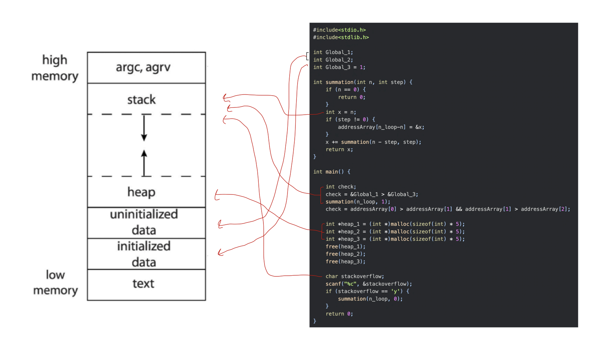
*ตัดส่วนที่เป็นการแสดงผลออก เพื่อใช้ในการวาด Diagram เท่านั้น*


## C: Linux Kernel

#### Requirement
    - ให้คอมไฟล์ Linux Kernel ที่เวอร์ชั้นแตกต่างจากที่ใช้อยู่ แล้วบูตเข้าเคอร์เนลใหม่นั้น
    - แสดงเวอร์ชั้นของเคอร์เนลที่มีอยู่แล้ว
    - คอมไฟล์เคอร์เนลและแสดงภาพตอนทำ menuconfig
    - แสดงหน้าบูตโหลดเดอร์
    - แสดงเวอร์ชั้นของเคอร์เนลใหม่

#### Complain
    > ลง Ubuntu เสร็จเปิด terminal ไม่ได้แถมวิธีแก้คือให้เปลี่ยนภาษาจาก English (US) เป็น English (canada) เหลือจะเชื่อ
    > พอเปิด terminal ก็ใช้ sudo ไม่ได้อีก ต้องไปเพิ่ม username ALL=(ALL:ALL) ALL ใน visudo 
    > พอจะคอมไพล์เคอร์เนล พื้นที่ไม่พออีกต้องไปสร้าง VM ใหม่แล้วทำใหม่ตั้งแต่ต้น TT
    > หลังจากทำทุกอย่างเสร็จหมด เปิดหน้าบูตโหลดเดอร์ แล้วเหมือนเดิมเป็ะ แล้วสรุปที่ทำมามันถูกรึเปล่าเนี่ย
    
### What I Do
#### สร้าง VM บน virtualBox โดยใช้ Ubuntu ISO
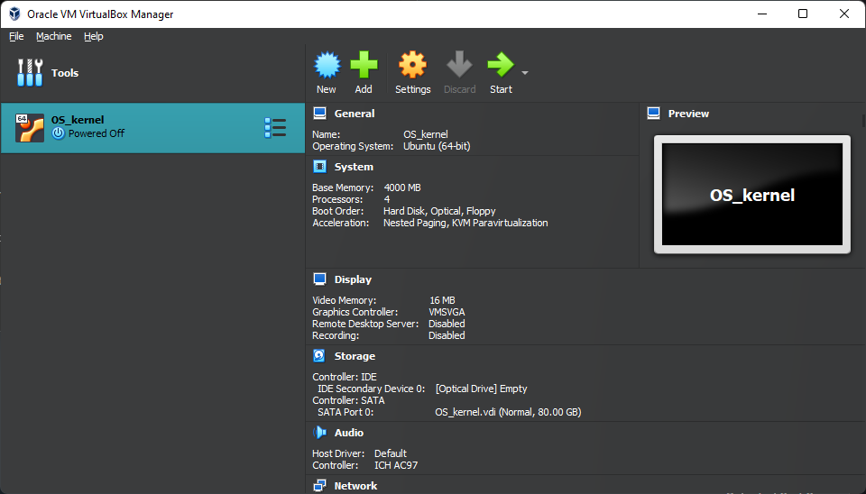
#### ทำ Port Forwarding เพื่อให้สามารถ remote เข้ามาได้
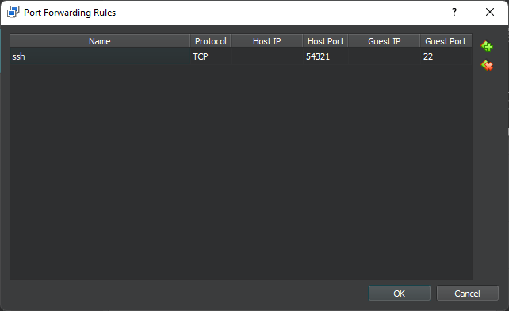
#### Old Kernel version
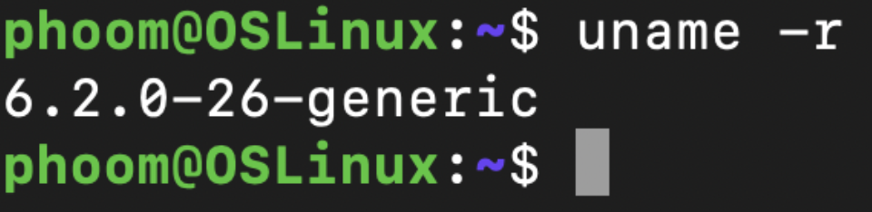

```shell
uname -r
```

#### ดาวน์โหลดเคอร์เนลเวอร์ชั้น 6.4.10 และทำการแตกไฟล์
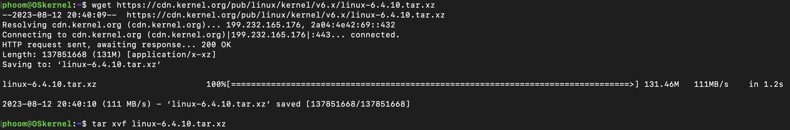
```shell
wget https://cdn.kernel.org/pub/linux/kernel/v6.x/linux-6.4.10.tar.xz
tar xvf linux-6.4.10.tar.xz 
```
#### ทำการคอนฟิคใน menuconfig และรันคำสั่ง make ทั้งหลาย
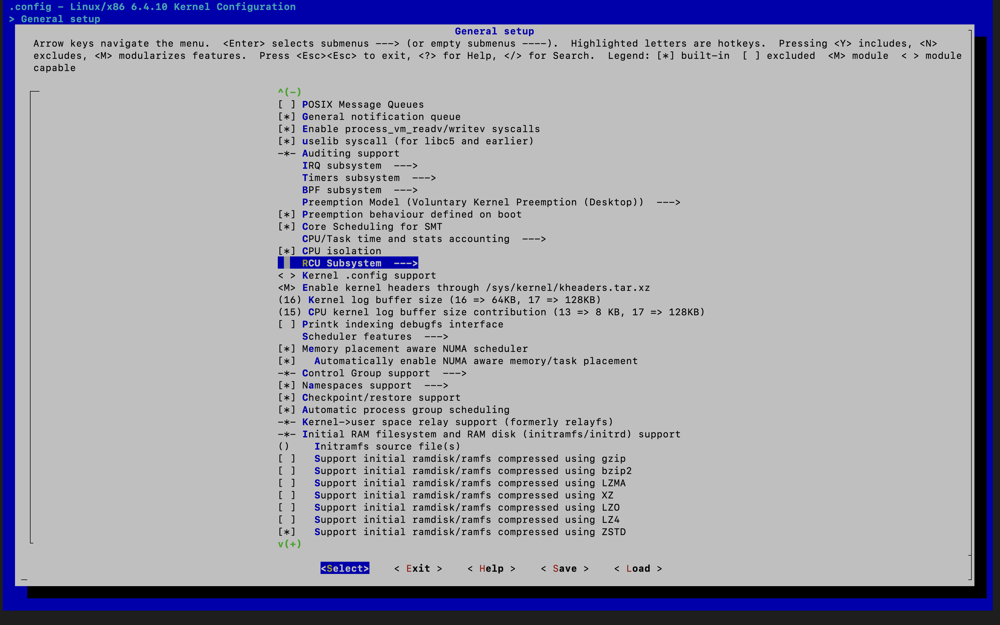
```shell
cd linux-6.4.10/
cp -v /boot/config-$(uname -r) .config
make menuconfig
scripts/config --disable SYSTEM_TRUSTED_KEYS    #ในไกด์บอกว่าถ้าเป็น ubuntu ต้องรันสองคำสั่งนี้ไม่งั้นเจอ error
scripts/config --disable SYSTEM_REVOCATION_KEYS
make -j4 #ตอนสร้าง VM ใส่ไป 4 processors
sudo make modules_install
sudo make install
```

#### GNUB
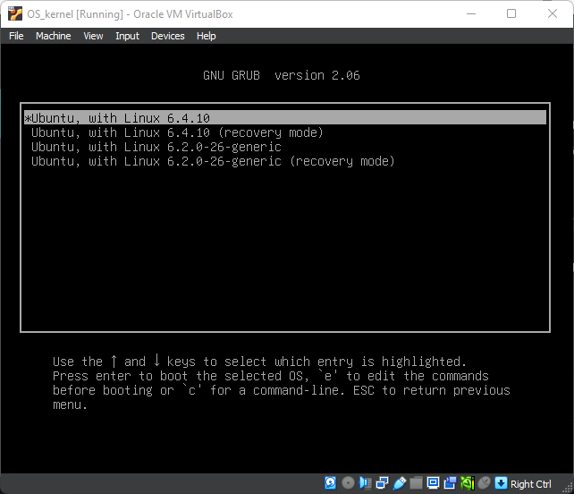

#### รีบูตเครื่อง
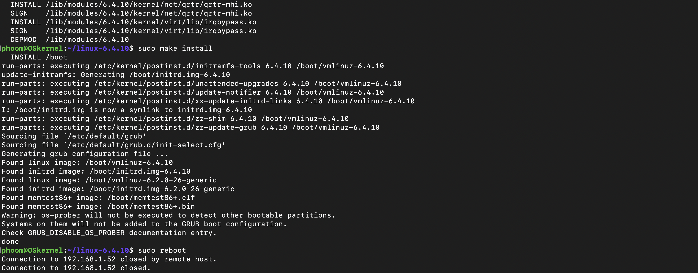
```shell
sudo reboot
```

#### New Kernel version
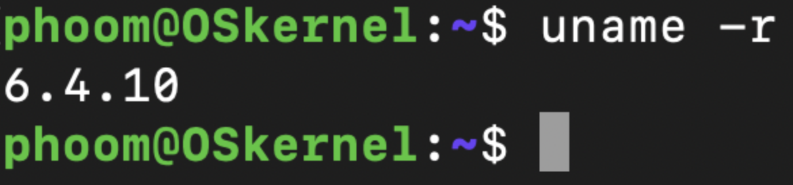

```shell
uname -r
```

#### [Guide](https://phoenixnap.com/kb/build-linux-kernel)


## D: Timing I/O

#### Requirement
    - ให้แสดงให้เห็นว่า I/O เป็นการทำงานที่ช้า
    - ให้เขียนโปรแกรมเพื่อแสดงเวลาที่ใช้ในการทำงาน
    - ใช้คำสั่งจับเวลา time ของลินุกซ์

#### Code
```python
import os
import time

n = 1000000000

time1 = time.time()
fp = open("input.txt", "w")
fp.write("save the world\n")
fp.close()
time2 = time.time()
n %= 18092020
time3 = time.time()

os.remove("input.txt")

print(f"time require for write a sentence to file: {time2-time1}s")
print(f"time require for modulo a number         : {time3-time2}s")
```

#### Output
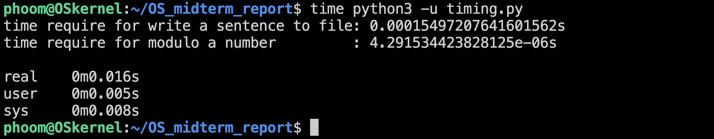
```shell
time python3 -u timing.py
```

#### Report
    จากผลลัพธ์ที่ออกมาจะเห็นได้ว่า
    เวลาที่ใช้ในการเขียนประโยคเพียงประโยคเดียวลงในไฟล์ คือ 1.54972e-4s
    ในขณะที่เวลาที่ใช้ในการ modulo ของเลข 1 พันล้าน    คือ 4.29153e-6s
    จะเห็นได้ว่าการเขียนประโยคเพียงประโยคเดียวลงในไฟล์
    ใช้เวลามากกว่าการทำ modulo ของเลข 1 พันล้านเกือบ 40 เท่า
    และผลลัพธ์ที่ได้จากคำสั่ง time บนลินุกซ์
    real 0m0.016s คือเวลาที่ใช้จริง
    user 0m0.005s คือเวลาที่ใช้ในการทำงานของ user space
    sys  0m0.008s คือเวลาที่ใช้ในการทำงานของ kernel space
    